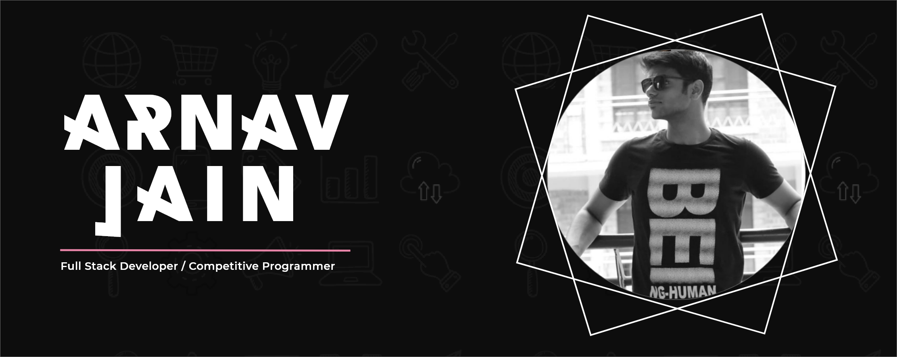

<!-- ### Hi there 👋 -->
<h1 align="center">Hey there, I'm Arnav Jain </h1>
<h3 align="center">A Passionate Developer 👨‍💻 | Maker 🤹‍♂️ | Competitive Programmer </h3>

<h3>📫 Lets Connect 🤝</h3>

 

<h3>🔭 Have a look at my work 👇</h3>

 

<h3>🌱 Have a look at my coding profiles 👇</h3>

 
 

<h2> ✔️ Tools and Techs Used by me 👇</h2>

 
 
 
 
 

<a href="https://github.com/Arnavjain1703">
 
 
 
 

<h2>⚡ Top langs :tongue:</h2>

